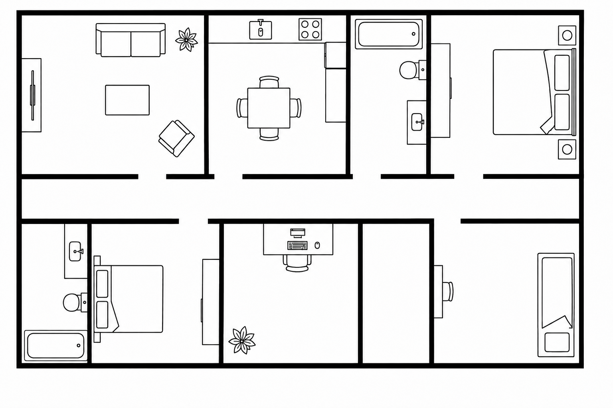

# Agent-Based Robot Vacuum Cleaner

## Overview

This project implements an agent-based robot vacuum cleaner simulation using the Mesa framework in Python.

The robot operates in a grid-based environment generated from a floor plan image. The environment contains walls, rooms, obstacles, and dirty cells that the robot must discover and clean autonomously.

The main goal of the project is to simulate intelligent agent behavior in an indoor environment by combining exploration, mapping, navigation, and cleaning strategies.

---

## Environment Representation

The apartment layout is represented using a floor plan image.



The image is processed and converted into a grid environment where:

* Black pixels represent walls and obstacles.
* White pixels represent accessible space.
* The robot can move only through accessible cells.
* Dirty cells are distributed throughout the environment.

---

## Technologies Used

* Python
* Mesa (Agent-Based Modeling Framework)
* NumPy
* Pillow (Image Processing)

---

## How the Simulation Works

### 1. Environment Initialization

The simulation loads the floor plan image and converts it into a grid representation.

Each cell is classified as:

* Wall
* Empty space
* Dirty space

The robot is placed at its starting position.

---

### 2. Exploration Phase

The robot begins by exploring the unknown environment.

During exploration it:

* Detects walls and boundaries.
* Discovers accessible cells.
* Builds an internal map of the apartment.
* Identifies reachable areas.

The exploration continues until the robot has mapped all reachable cells.

---

### 3. Cleaning Phase

After exploration is completed, the robot switches to cleaning mode.

During cleaning it:

* Navigates through discovered areas.
* Searches for dirty cells.
* Cleans each dirty cell it encounters.
* Updates the environment state.

---

### 4. Return Home

Once all reachable dirty cells have been cleaned, the robot calculates a path back to its starting position and returns home.

---

## Simulation Statistics

At the end of the simulation, statistics such as:

* Total steps taken
* Number of discovered cells
* Environment coverage
* Number of cleaned cells
* Cleaning percentage
* Return-to-home status

are displayed.

---

## Project Structure

```text
robot-vacuum-rl/
│
├── assets/
│   └── floorplan.png
│
├── agents.py
├── model.py
├── main.py
│
└── README.md
```

---

## Future Improvements

Potential future enhancements include:

* Reinforcement Learning (Q-Learning / Deep Q-Networks)
* Multi-agent cleaning robots
* Dynamic obstacles
* Battery management
* Charging stations
* Advanced path planning algorithms
* Real-time mapping and localization

---

## Authors

Leonida Kostova 231018
Simona Janceva 231009
